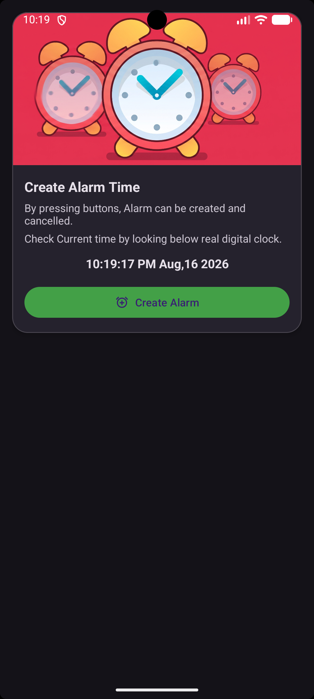
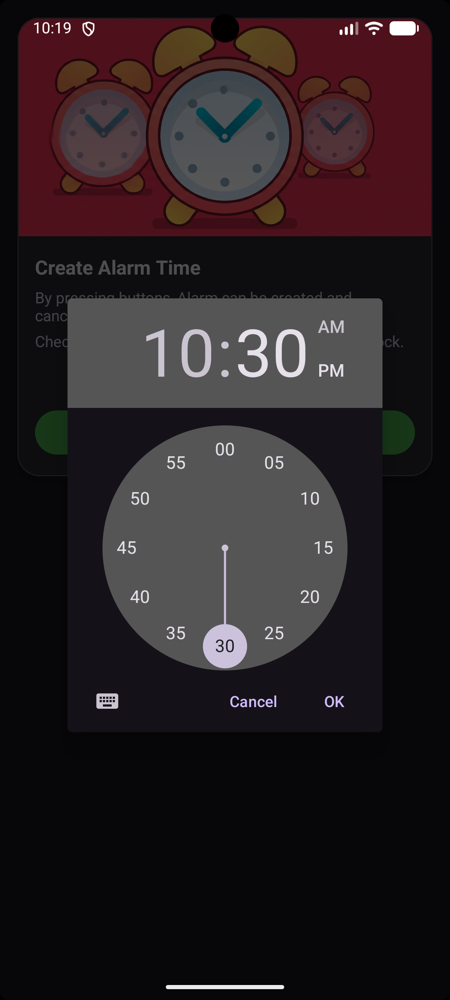
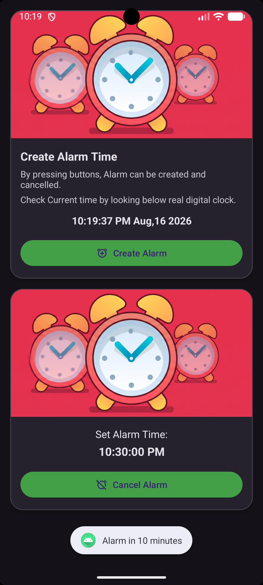
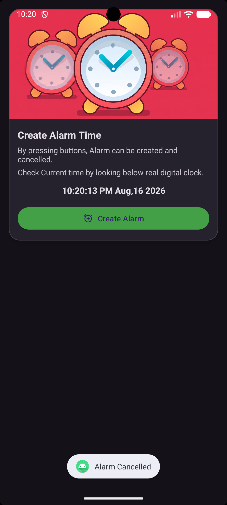

# 24012011128_MAD_PRAC4

## MAD Alarm Application

An Android alarm application developed using Kotlin and XML. The application allows the user to select an alarm time, schedule the alarm, play an alarm sound at the selected time, and cancel the alarm.

## Features

- Display current date and time
- Select alarm time using TimePickerDialog
- Create and schedule an alarm
- Display the selected alarm time
- Cancel the scheduled alarm
- Play alarm sound when the scheduled time is reached
- Use AlarmManager for alarm scheduling
- Use BroadcastReceiver to receive the alarm event
- Use Service to play the alarm sound
- Use MediaPlayer for audio playback
- Material CardView based user interface
- Exact alarm support

## Technologies Used

- Kotlin
- XML
- Android Studio
- Android SDK
- Material Components
- ConstraintLayout
- AlarmManager
- PendingIntent
- BroadcastReceiver
- Service
- MediaPlayer
- TimePickerDialog
- TextClock

#Screenshots

|  |  |  |  |
| :---: | :---: | :---: | :---: |
|  |  |  |  |
----

## Application Flow

```text
User selects alarm time
        ↓
TimePickerDialog
        ↓
MainActivity
        ↓
AlarmManager
        ↓
PendingIntent
        ↓
AlarmBroadcastReceiver
        ↓
AlarmService
        ↓
MediaPlayer
        ↓
Alarm Sound
```

## Project Structure

```text
24012011128_MAD_PRAC4/
│
├── app/
│   └── src/
│       └── main/
│           ├── java/
│           │   └── com/example/a24012011128_mad_practical4/
│           │       ├── MainActivity.kt
│           │       ├── AlarmBroadcastReceiver.kt
│           │       └── AlarmService.kt
│           │
│           ├── res/
│           │   ├── drawable/
│           │   │   ├── alarm_clock.png
│           │   │   ├── ic_alarm.xml
│           │   │   ├── ic_launcher_background.xml
│           │   │   └── ic_launcher_foreground.xml
│           │   │
│           │   ├── layout/
│           │   │   └── activity_main.xml
│           │   │
│           │   ├── raw/
│           │   │   └── alarm.mp3
│           │   │
│           │   ├── values/
│           │   │   ├── colors.xml
│           │   │   ├── strings.xml
│           │   │   └── themes.xml
│           │   │
│           │   ├── values-night/
│           │   │   └── themes.xml
│           │   │
│           │   └── xml/
│           │       ├── backup_rules.xml
│           │       └── data_extraction_rules.xml
│           │
│           └── AndroidManifest.xml
│
├── screenshots/
│   ├── main_screen.png
│   ├── alarm_set.png
│   └── alarm_ringing.png
│
├── build.gradle.kts
├── settings.gradle.kts
├── gradle.properties
├── gradlew
├── gradlew.bat
└── README.md
```

## MainActivity

`MainActivity` manages the main user interface and alarm controls.

It is responsible for:

- Displaying the current time
- Opening the TimePickerDialog
- Reading the selected hour and minute
- Calculating the alarm time
- Scheduling the alarm
- Displaying the selected alarm time
- Cancelling the alarm

## TimePickerDialog

The `TimePickerDialog` allows the user to select the hour and minute for the alarm.

After selecting the time, the application checks whether the selected time has already passed. If it has passed, the alarm is scheduled for the next day.

## AlarmManager

`AlarmManager` is used to schedule the alarm at the selected time.

The application uses:

```kotlin
alarmManager.setExactAndAllowWhileIdle(
    AlarmManager.RTC_WAKEUP,
    millisTime,
    pendingIntent
)
```

This allows the alarm to be triggered at the specified time even when the device is idle.

## PendingIntent

A `PendingIntent` is created for `AlarmBroadcastReceiver`.

```text
AlarmManager
      ↓
PendingIntent
      ↓
AlarmBroadcastReceiver
```

The PendingIntent allows Android to trigger the broadcast when the scheduled alarm time is reached.

## AlarmBroadcastReceiver

`AlarmBroadcastReceiver` extends `BroadcastReceiver`.

When the alarm is triggered, the receiver receives the broadcast and starts `AlarmService`.

```text
AlarmManager
      ↓
AlarmBroadcastReceiver
      ↓
AlarmService
```

It also handles the stop action when the alarm is cancelled.

## AlarmService

`AlarmService` is responsible for playing the alarm sound.

The service uses `MediaPlayer` to load and play:

```text
res/raw/alarm.mp3
```

The alarm sound is played continuously until the service is stopped.

## MediaPlayer

`MediaPlayer` is used for alarm audio playback.

When the alarm starts:

```text
MediaPlayer
     ↓
alarm.mp3
     ↓
Alarm Sound
```

When the alarm is stopped, the MediaPlayer is stopped and released.

## Alarm Cancellation

The user can cancel the alarm using the **Cancel Alarm** button.

The application:

1. Cancels the scheduled PendingIntent.
2. Sends the stop action.
3. Stops the AlarmService.
4. Stops and releases the MediaPlayer.
5. Shows the Create Alarm option again.

## Exact Alarm Permission

The application uses:

```xml
<uses-permission
    android:name="android.permission.SCHEDULE_EXACT_ALARM" />
```

On Android versions that require exact alarm access, the application checks whether exact alarms can be scheduled before creating the alarm.

## UI Components

The main screen uses:

- ConstraintLayout
- MaterialCardView
- MaterialButton
- TextView
- TextClock
- ImageView

The interface contains separate cards for creating and cancelling an alarm.

## Important Classes

| Class | Purpose |
|---|---|
| `MainActivity` | Controls the main UI and alarm scheduling |
| `AlarmBroadcastReceiver` | Receives the scheduled alarm broadcast |
| `AlarmService` | Plays and stops the alarm sound |

## Important Android Components

| Component | Purpose |
|---|---|
| `AlarmManager` | Schedules the alarm |
| `PendingIntent` | Provides the operation to be triggered |
| `BroadcastReceiver` | Receives the alarm event |
| `Service` | Runs the alarm audio operation |
| `MediaPlayer` | Plays the alarm sound |
| `TimePickerDialog` | Allows the user to select alarm time |
| `TextClock` | Displays the current time |

## Requirements

- Android Studio
- Android SDK
- JDK 11
- Android device or emulator
- Minimum SDK: Android 7.0 (API 24)
- Target SDK: 37

## How to Run

1. Open the project in Android Studio.
2. Wait for Gradle synchronization to complete.
3. Connect an Android device or start an Android emulator.
4. Click the **Run** button.
5. The application will open on the main screen.
6. Select the required alarm time.
7. Press **Create Alarm**.
8. Wait until the selected time.
9. The alarm sound will start automatically.
10. Press **Cancel Alarm** to stop the alarm.

## Author

**Shaurya Patel**

**Enrollment No.: 24012011128**
